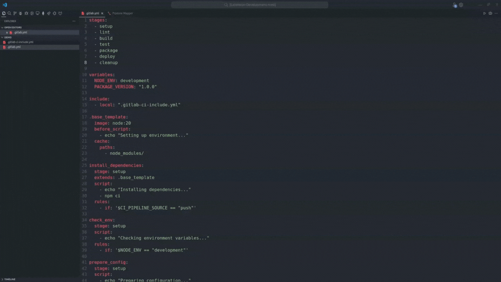

# Pipeline Mapper

Visualize **GitLab CI/CD pipeline YAML files locally**, without pushing your changes.

> ⚠️ **Disclaimer:** This is an independent, community-developed VS Code extension and is **not affiliated with, endorsed by, or officially supported by GitLab Inc**. For production pipelines, always validate using the official GitLab CI/CD system.

## Quick Usage

1. Open a `.yml` or `.yaml` file in VS Code.
2. Open the Command Palette: `Ctrl + Shift + P` (Cmd on macOS).
3. Run: `Generate Pipeline Mapper`

> Works only with valid GitLab CI/CD YAML files.

## Features

- Automatic stage mapping for visual representation of jobs by stage.
- Show basic information of jobs.
- Show dependencies of jobs (individually or all).
- Automatic dependency grouping (`needGroup`) for visual mapping.
- Recursive `include` support with cycle detection.
- Recursive `extends` resolution with inheritance merging.
- `needs` resolution with cycle and post-stage validation.
- Apply rules (`if`, `exists`, and `changes` supporting `||` logical OR) to see how change the pipeline flow.
- Detailed error handling for invalid YAML, missing includes, extends, or needs.
- Hidden job filtering (jobs starting with `.` are ignored).

## Known Issues

- YAML anchors (`&`, `*`) are not supported.
- Remote includes (`include: remote:`) are not supported.
- Jobs with **optional dependencies** may appear as errors.
- `rules` with logical AND (`&&`), negation (`!`), or parentheses are not supported.

## Try the Code

If you’d like to run or modify the extension locally:

### Run code

1. Clone this repository
2. Install dependencies: `pnpm install`
3. Start debugging in VS Code (`F5`) → a new Extension Development Host will open.
4. Open a `.yml` file and run `Generate Pipeline Mapper` from the Command Palette.

### Make changes

- **Frontend changes:** Rerun `Generate Pipeline Mapper`.
- **Backend changes:** Press `Ctrl + R` in the Extension Host to reload.

### Run tests

- Run `pnpm run lint` to check code style.
- Run `pnpm run test:only` to run only tests.
- Run `pnpm run test` to run linting and tests.     

## Changelog

See [CHANGELOG.md](./CHANGELOG.md) for release history.

## License

This extension is licensed under the [MIT License](LICENSE).
